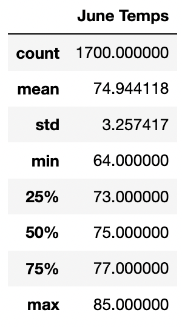
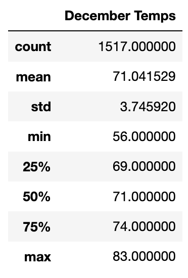
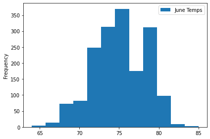
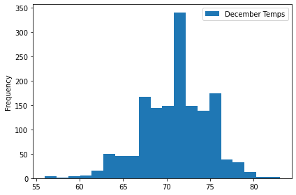
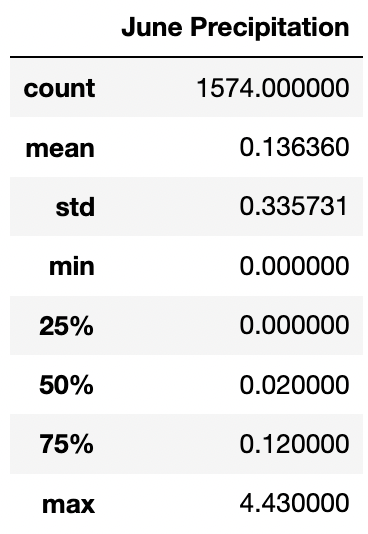
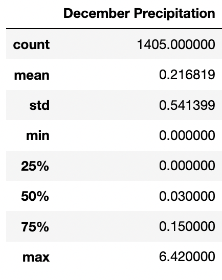
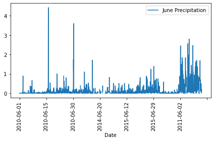
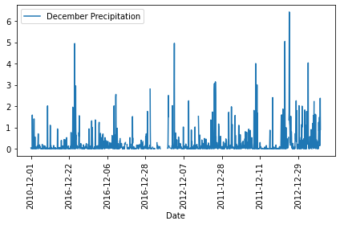

# Surf's Up with Advanced Data Storage and Retrieval

## Overview 
***Background***
While trying to start up a Surf and Shake shop in Oahu, investor W. Avy would like to know more about the weather on this island - and if a Surf and Shake shop could be successful. Since W. Avy has previously invested in a similar business that failed due to weather, he wants us to analyze the weather conditions from the island of O'ahu, HI before he invests in our startup company. 

***Purpose***
After the initial analysis, investor W. Avy wants more information about temperature trends. He specifically wants temperature data for the months of June and December in O'ahu to determine if the Surf and Shake shop business will be sustainable/ successful year-round. 

This analysis will use Python, Pandas, and SQLAlchemy to:
- Determine the Summary Statitistics for June
- Determine the Summary Statitistics for December 
- Report our findings with statistical analysis 

## Resources 
- Data Source: Original data ([hawaii.sqlite](https://github.com/meghanhkoon/surfs_up/blob/main/hawaii.sqlite))
- Software: Python, Pandas, SQLAlchemy, SQLite database, Matplotlib, and Jupyter Notebook

## Results

Using Python, Pandas and SQLAlchemy, we first wrote a [query](https://github.com/meghanhkoon/surfs_up/blob/main/SurfsUp_Challenge.ipynb) to filter the date column from the Measurement table to retrieve all the temperatures for the month of June. We then converted the data to a list to create a DataFrame to use the .describe() function to find the summary statistics for the month of June. Lastly, we created a graph using Matplotlib.

To see what the weather is like at the end of the year, we use the same process to find the temperature statistics for the month of December. 

See the statistics and graphs for June and December below:

  
  

From our summary statistics for temperatures in June and December, we can conclude: 

1. 
2.
3.

## Summary

  
  
